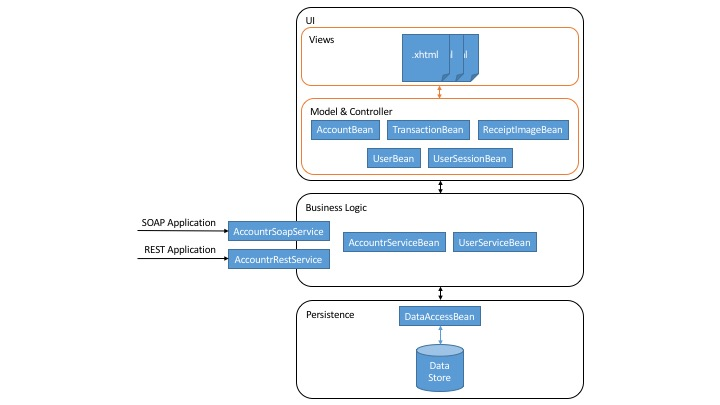

# Accountr
## Description
A small enterprise java application. 'Accountr' can be used to manage transactions for several accounts. This application usess the following technologies:

* JPA
* JSF
* CDI
* jboss/wildfly security
* SOAP/REST WS
* Arquillian integration tests
 
## Architecture
### Components
#### Overview
The architecture of this app is basically structured in three layers:

* **UI** The user interface is implemented as a web application. It is split into several views defined in *.xhtml* and uses templated sub-components. Those views access their data from underlaying CDI beans via JSF-EL.
* **Business Logic** The business logic layer offers two services: One for the domain logic also known as managing account and transaction objects plus another service with the purpose of managing user accounts. All the external interfaces are also placed in this layer.
* **Persistence** The bottom layer is responsible for persisting all the application entities (accounts, transactions, user accounts). All the necessary CRUD logic is encapsulated in a special CDI bean.

The following image shows an architecture overview:
 


#### Package structure
The following listing shows all packages and classes with their purpose.

```
de.thi.phm6101.accountr
    ├── domain
    │   ├── AbstractEntity.java				Abstract superclass for all JPA entities
    │   ├── Account.java					Account entity
    │   ├── Transaction.java				Transaction entity
    │   ├── User.java						User account entity
    │   └── UserRole.java					User role entity
    ├── exception
    │   ├── EntityExistsException.java		Custom exception
    │   └── EntityNotFoundException.java	Custom exception
    ├── persistence
    │   └── DataAccessBean.java				DAO for all entities derived from AbstractEntity
    ├── rest
    │   └── RestApplication.java			Rest application
    ├── service
    │   ├── AccountrRestService.java		Defines REST web service
    │   ├── AccountrServiceBean.java		CDI bean for all domain specific business logic functions
    │   ├── AccountrSoapService.java		Defines SOAP web service
    │   └── UserServiceBean.java			CDI bean for user account management
    ├── util
    │   └── JsfUtil.java					JSF Helper functions
    ├── validation
    │   ├── AccountNameValidator.java		JSF Validator
    │   ├── ImageValidator.java				JSF Validator
    │   └── UserNameValidator.java			JSF Validator
    └── web
        └── model
            ├── AccountBean.java			CDI named bean representing account model & controller
            ├── ReceiptImageBean.java		CDI named bean used for accessing receipt images
            ├── TransactionBean.java		CDI named bean representing transaction model & controller
            ├── UserBean.java				CDI named bean representing user account model & controller
            └── UserSessionBean.java		CDI named bean used for controlling user session
```
#### UI structure
The following listing shows the web application views with their purpose

```
.
├── META-INF
│   └── template
│       ├── content-account-panel.xhtml		Component displaying a panel for the selected account
│       ├── content-transaction-table.xhtml	Component displaying all transactions for the selected account
│       ├── footer.xhtml					Footer template
│       ├── header.xhtml					Header template with navbar
│       ├── modal-image.xhtml				Dialog displaying an image for the selected transaction
│       ├── page.xhtml						Page component
│       └── template.xhtml					Main template
├── account-form.xhtml						View used for creating and editing accounts (Restricted)
├── account.xhtml							View displaying an account with all transactions
├── accounts.xhtml							View displaying all or searched accounts
├── error.xhtml								View displaying an error page
├── index.html								Index page redirecting to 'accounts.xhtml'
├── login-error.xhtml						View displaying login error
├── login.xhtml								View displaying the login form
├── transaction-form.xhtml					View used for creating transactions (Restricted)
└── user-form.xhtml							View used for creating users
```

### Domain
The following entities are used in the applications data model:

* **Account** An account which has a list of transactions
* **Transaction** A transaction describes the operation of adding or removing money
* **User** A user account which has a list of roles
* **UserRole** A UserRole is used to define a users ressource access rights

Their relations are described by the following diagramm:


### Interfaces (Services)
#### REST Service
The REST interface includes the following paths:

`%APPLICATION_URL%/api/accounts` List all accounts.

`%APPLICATION_URL%/api/accounts/%ACCOUNT_ID%` Receive data of account with id *%ACCOUNT_ID%*.

#### SOAP Service
The web service interface can be received from `%APPLICATION_URL%/AccountrSoapService?wsdl`.

```
<wsdl:definitions xmlns:xsd="http://www.w3.org/2001/XMLSchema" xmlns:wsdl="http://schemas.xmlsoap.org/wsdl/" xmlns:tns="http://service.accountr.phm6101.thi.de/" xmlns:soap="http://schemas.xmlsoap.org/wsdl/soap/" xmlns:ns1="http://schemas.xmlsoap.org/soap/http" name="AccountrSoapServiceService" targetNamespace="http://service.accountr.phm6101.thi.de/">
<wsdl:types>
<xs:schema xmlns:xs="http://www.w3.org/2001/XMLSchema" xmlns:tns="http://service.accountr.phm6101.thi.de/" elementFormDefault="unqualified" targetNamespace="http://service.accountr.phm6101.thi.de/" version="1.0">
<xs:element name="accountById" type="tns:accountById"/>
<xs:element name="accountByIdResponse" type="tns:accountByIdResponse"/>
<xs:element name="accounts" type="tns:accounts"/>
<xs:element name="accountsResponse" type="tns:accountsResponse"/>
<xs:complexType name="accounts">
<xs:sequence/>
</xs:complexType>
<xs:complexType name="accountsResponse">
<xs:sequence>
<xs:element maxOccurs="unbounded" minOccurs="0" name="return" type="tns:account"/>
</xs:sequence>
</xs:complexType>
<xs:complexType name="account">
<xs:complexContent>
<xs:extension base="tns:abstractEntity">
<xs:sequence>
<xs:element minOccurs="0" name="currencyCode" type="xs:string"/>
<xs:element minOccurs="0" name="description" type="xs:string"/>
<xs:element name="initialBalance" type="xs:double"/>
<xs:element minOccurs="0" name="name" type="xs:string"/>
</xs:sequence>
</xs:extension>
</xs:complexContent>
</xs:complexType>
<xs:complexType abstract="true" name="abstractEntity">
<xs:sequence/>
</xs:complexType>
<xs:complexType name="transaction">
<xs:complexContent>
<xs:extension base="tns:abstractEntity">
<xs:sequence>
<xs:element minOccurs="0" name="account" type="tns:account"/>
<xs:element name="amount" type="xs:double"/>
<xs:element minOccurs="0" name="date" type="xs:dateTime"/>
<xs:element minOccurs="0" name="description" type="xs:string"/>
<xs:element minOccurs="0" name="receiptFileName" type="xs:string"/>
<xs:element minOccurs="0" name="receiptImage" type="xs:base64Binary"/>
</xs:sequence>
</xs:extension>
</xs:complexContent>
</xs:complexType>
<xs:complexType name="accountById">
<xs:sequence>
<xs:element minOccurs="0" name="id" type="xs:long"/>
</xs:sequence>
</xs:complexType>
<xs:complexType name="accountByIdResponse">
<xs:sequence>
<xs:element minOccurs="0" name="return" type="tns:account"/>
</xs:sequence>
</xs:complexType>
</xs:schema>
</wsdl:types>
<wsdl:message name="accounts">
<wsdl:part element="tns:accounts" name="parameters"></wsdl:part>
</wsdl:message>
<wsdl:message name="accountsResponse">
<wsdl:part element="tns:accountsResponse" name="parameters"></wsdl:part>
</wsdl:message>
<wsdl:message name="accountByIdResponse">
<wsdl:part element="tns:accountByIdResponse" name="parameters"></wsdl:part>
</wsdl:message>
<wsdl:message name="accountById">
<wsdl:part element="tns:accountById" name="parameters"></wsdl:part>
</wsdl:message>
<wsdl:portType name="AccountrSoapService">
<wsdl:operation name="accounts">
<wsdl:input message="tns:accounts" name="accounts"></wsdl:input>
<wsdl:output message="tns:accountsResponse" name="accountsResponse"></wsdl:output>
</wsdl:operation>
<wsdl:operation name="accountById">
<wsdl:input message="tns:accountById" name="accountById"></wsdl:input>
<wsdl:output message="tns:accountByIdResponse" name="accountByIdResponse"></wsdl:output>
</wsdl:operation>
</wsdl:portType>
<wsdl:binding name="AccountrSoapServiceServiceSoapBinding" type="tns:AccountrSoapService">
<soap:binding style="document" transport="http://schemas.xmlsoap.org/soap/http"/>
<wsdl:operation name="accounts">
<soap:operation soapAction="" style="document"/>
<wsdl:input name="accounts">
<soap:body use="literal"/>
</wsdl:input>
<wsdl:output name="accountsResponse">
<soap:body use="literal"/>
</wsdl:output>
</wsdl:operation>
<wsdl:operation name="accountById">
<soap:operation soapAction="" style="document"/>
<wsdl:input name="accountById">
<soap:body use="literal"/>
</wsdl:input>
<wsdl:output name="accountByIdResponse">
<soap:body use="literal"/>
</wsdl:output>
</wsdl:operation>
</wsdl:binding>
<wsdl:service name="AccountrSoapServiceService">
<wsdl:port binding="tns:AccountrSoapServiceServiceSoapBinding" name="AccountrSoapServicePort">
<soap:address location="http://localhost:8080/accountr/AccountrSoapService"/>
</wsdl:port>
</wsdl:service>
</wsdl:definitions>
```


